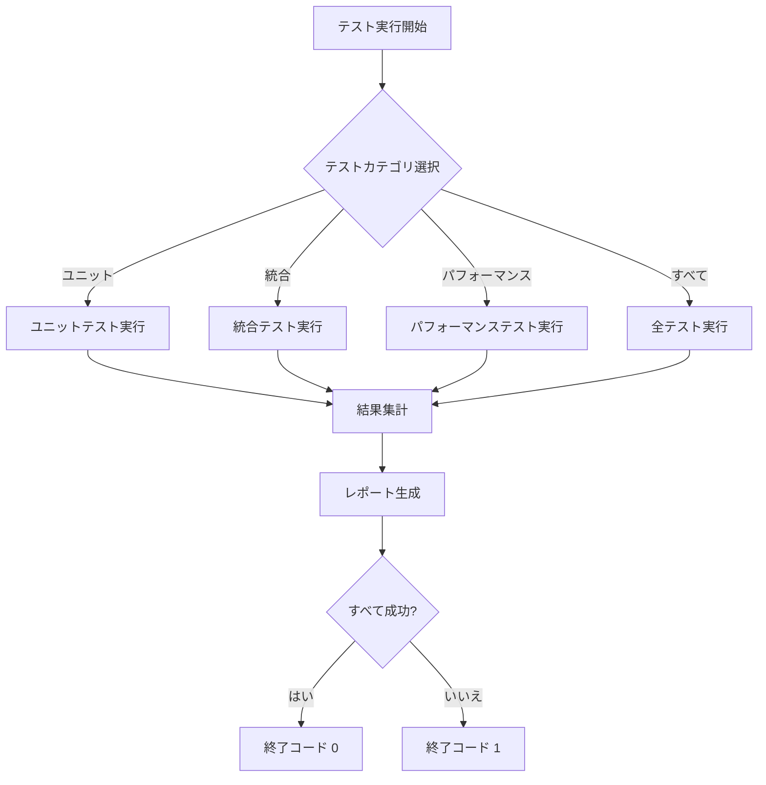

# 設計ドキュメント: テストカバレッジ改善

## 概要

Weekly Task Boardアプリケーションの包括的なテストカバレッジを確立するための設計です。現在のテストスイートは20テストで構成されていますが、最近のバグ(ゾンビタスク、繰り返しタスクの過去日付生成)が既存のテストで検出されませんでした。

本設計では、以下を実現します:

- タスク基本操作の完全なテストカバレッジ
- 繰り返しタスクの正確性検証
- 統計計算エンジンの精度保証
- データ永続化の信頼性確保
- UI操作の正確性検証
- エッジケースとエラー処理の網羅
- 統合テストによるエンドツーエンド検証
- パフォーマンステストによる品質保証

テスト戦略は、ユニットテストとプロパティベーステストの二重アプローチを採用し、具体的な例とユニバーサルな性質の両方を検証します。

## アーキテクチャ

### テストファイル構造

```
tests/
├── unit/
│   ├── test-task-operations.js          # 要件1: タスク基本操作
│   ├── test-recurring-tasks.js          # 要件2: 繰り返しタスク
│   ├── test-statistics-engine.js        # 要件3: 統計計算(既存)
│   ├── test-data-persistence.js         # 要件4: データ永続化
│   ├── test-ui-operations.js            # 要件5: UI操作
│   ├── test-edge-cases.js               # 要件6: エッジケース
│   ├── test-time-management.js          # 要件8: 時間管理
│   ├── test-templates.js                # 要件9: テンプレート
│   ├── test-archive.js                  # 要件10: アーカイブ
│   ├── test-data-migration.js           # 要件11: データマイグレーション
│   ├── test-weekday-manager.js          # 要件12: 曜日管理
│   └── test-export-import.js            # 要件13: エクスポート・インポート
├── integration/
│   └── test-integration-scenarios.js    # 要件7: 統合テスト
├── performance/
│   └── test-performance.js              # 要件14: パフォーマンス
└── utils/
    ├── test-helpers.js                  # テストヘルパー関数
    ├── mock-data-generator.js           # モックデータ生成
    └── assertions.js                    # カスタムアサーション
```

### テストインフラストラクチャ

テストランナーとして既存の`run-tests.js`と`run-tests.sh`を拡張し、以下の機能を提供します:

- すべてのテストを単一コマンドで実行
- カテゴリ別テスト実行(ユニット、統合、パフォーマンス)
- 詳細なテスト結果レポート
- 失敗したテストの詳細情報表示
- テスト実行時間の測定
- CI/CD環境での実行サポート

### テスト実行フロー



## コンポーネントとインターフェース

### テストヘルパーモジュール

#### MockLocalStorage

localStorageのモック実装を提供します。

```javascript
class MockLocalStorage {
    constructor()
    getItem(key): string | null
    setItem(key: string, value: string): void
    removeItem(key: string): void
    clear(): void
}
```

#### TestDataGenerator

テスト用のモックデータを生成します。

```javascript
class TestDataGenerator {
    generateTask(overrides?: object): Task
    generateTasks(count: number): Task[]
    generateRecurringTask(pattern: string): Task
    generateTemplate(): Template
    generateSettings(): Settings
}
```

#### CustomAssertions

カスタムアサーション関数を提供します。

```javascript
function assertTaskEquals(actual: Task, expected: Task): void
function assertTaskArrayEquals(actual: Task[], expected: Task[]): void
function assertTimeWithinRange(actual: number, expected: number, tolerance: number): void
function assertDateEquals(actual: string, expected: string): void
```

### テストランナー

#### TestRunner

テストの実行と結果の集計を管理します。

```javascript
class TestRunner {
    constructor()
    runTest(name: string, testFn: Function): void
    runTestSuite(suiteName: string, tests: Function[]): void
    getResults(): TestResults
    printSummary(): void
}

interface TestResults {
    total: number
    passed: number
    failed: number
    details: TestDetail[]
}

interface TestDetail {
    name: string
    status: 'PASS' | 'FAIL' | 'ERROR'
    message?: string
    duration?: number
}
```

## データモデル

### Task

タスクオブジェクトの構造:

```javascript
interface Task {
    id: string                      // 一意のID
    name: string                    // タスク名
    estimated_time: number          // 見積時間(時間単位)
    actual_time: number             // 実績時間(時間単位)
    priority: 'low' | 'medium' | 'high'  // 優先度
    category: string                // カテゴリ
    assigned_date: string | null    // 担当日(YYYY-MM-DD)
    completed: boolean              // 完了フラグ
    is_recurring: boolean           // 繰り返しフラグ
    recurrence_pattern: string | null  // 繰り返しパターン
    recurrence_end_date: string | null // 繰り返し終了日
    details?: string                // 詳細メモ
}
```

### Template

テンプレートオブジェクトの構造:

```javascript
interface Template {
    id: string                      // 一意のID
    name: string                    // テンプレート名
    tasks: Task[]                   // タスクリスト
    usage_count: number             // 使用回数
    created_at: string              // 作成日時
}
```

### Settings

設定オブジェクトの構造:

```javascript
interface Settings {
    ideal_daily_minutes: number     // 理想稼働時間(分)
    weekday_visibility: {
        monday: boolean
        tuesday: boolean
        wednesday: boolean
        thursday: boolean
        friday: boolean
        saturday: boolean
        sunday: boolean
    }
    theme?: 'light' | 'dark'        // テーマ
}
```

### StatisticsResult

統計計算結果の構造:

```javascript
interface CompletionRateResult {
    week_start: string              // 週の開始日
    total_tasks: number             // 総タスク数
    completed_tasks: number         // 完了タスク数
    completion_rate: number         // 完了率(0-100)
    is_valid: boolean               // 計算の有効性
}

interface CategoryTimeAnalysis {
    week_start: string
    categories: {
        [categoryKey: string]: {
            name: string
            estimated_time: number
            actual_time: number
            variance: number
            task_count: number
            completed_count: number
        }
    }
    total_estimated_time: number
    total_actual_time: number
    is_valid: boolean
}

interface DailyWorkTime {
    week_start: string
    daily_breakdown: {
        [dateString: string]: {
            date: string
            day_name: string
            estimated_time: number
            actual_time: number
            variance: number
            task_count: number
            completed_count: number
        }
    }
    total_estimated_time: number
    total_actual_time: number
    is_valid: boolean
}
```

