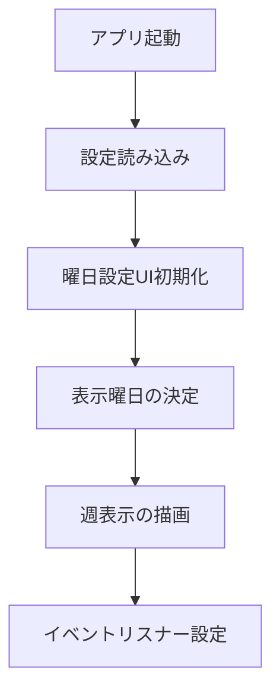
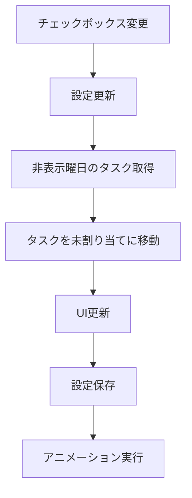
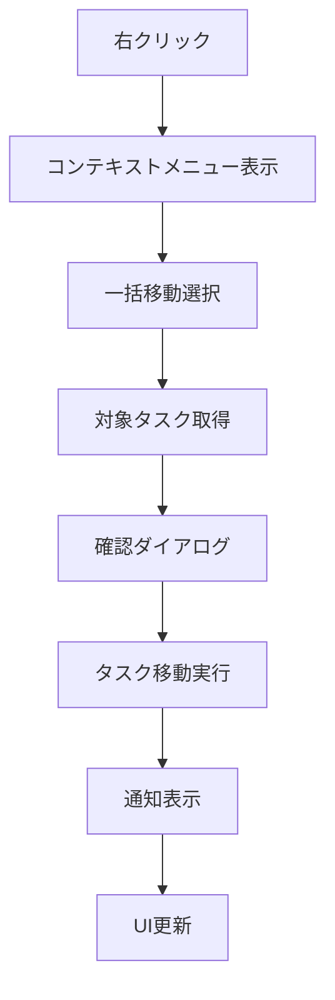

# 曜日表示設定機能 設計書

## 概要

ユーザーが各曜日の表示/非表示を個別に設定でき、特定の日のタスクを一括で未割り当てに移動できる機能の詳細設計。

## アーキテクチャ

### システム構成

```
┌─────────────────────────────────────────────────────────┐
│                    UI Layer                             │
├─────────────────────────────────────────────────────────┤
│ ┌─────────────────┐ ┌─────────────────┐ ┌─────────────┐ │
│ │  Weekday        │ │  Context Menu   │ │  Settings   │ │
│ │  Settings UI    │ │  Component      │ │  Panel      │ │
│ └─────────────────┘ └─────────────────┘ └─────────────┘ │
├─────────────────────────────────────────────────────────┤
│                  Business Logic                         │
├─────────────────────────────────────────────────────────┤
│ ┌─────────────────┐ ┌─────────────────┐ ┌─────────────┐ │
│ │  Weekday        │ │  Task Bulk      │ │  UI         │ │
│ │  Manager        │ │  Mover          │ │  Controller │ │
│ └─────────────────┘ └─────────────────┘ └─────────────┘ │
├─────────────────────────────────────────────────────────┤
│                  Data Layer                             │
├─────────────────────────────────────────────────────────┤
│ ┌─────────────────┐ ┌─────────────────┐ ┌─────────────┐ │
│ │  Settings       │ │  Task Data      │ │  Validation │ │
│ │  Storage        │ │  Manager        │ │  Service    │ │
│ └─────────────────┘ └─────────────────┘ └─────────────┘ │
└─────────────────────────────────────────────────────────┘
```

## コンポーネント設計

### 1. WeekdayManager (曜日管理)

**責務**: 曜日の表示/非表示状態を管理

```javascript
class WeekdayManager {
    constructor() {
        this.weekdaySettings = {
            monday: true,
            tuesday: true,
            wednesday: true,
            thursday: true,
            friday: true,
            saturday: true,
            sunday: true
        };
    }
    
    // 設定の読み込み
    loadSettings()
    
    // 設定の保存
    saveSettings()
    
    // 曜日の表示/非表示切り替え
    toggleWeekday(dayName, visible)
    
    // 表示中の曜日一覧を取得
    getVisibleWeekdays()
    
    // 非表示の曜日一覧を取得
    getHiddenWeekdays()
    
    // 曜日が表示されているかチェック
    isWeekdayVisible(dayName)
}
```

### 2. TaskBulkMover (タスク一括移動)

**責務**: 特定の日のタスクを一括で移動

```javascript
class TaskBulkMover {
    // 指定日のタスクを未割り当てに移動
    moveTasksToUnassigned(dateString)
    
    // 移動対象のタスクを取得
    getTasksForDate(dateString)
    
    // タスクの移動実行
    executeBulkMove(tasks)
    
    // 移動結果の通知
    notifyMoveResult(movedCount, date)
}
```

### 3. WeekdaySettingsUI (設定UI)

**責務**: 曜日設定のユーザーインターフェース

```javascript
class WeekdaySettingsUI {
    // 設定UIの初期化
    initialize()
    
    // チェックボックスの生成
    createWeekdayCheckboxes()
    
    // イベントリスナーの設定
    setupEventListeners()
    
    // UIの更新
    updateUI()
    
    // 設定変更時の処理
    handleSettingChange(dayName, checked)
}
```

### 4. ContextMenuComponent (コンテキストメニュー)

**責務**: 日付列の右クリックメニュー

```javascript
class ContextMenuComponent {
    // コンテキストメニューの表示
    showContextMenu(event, dateString)
    
    // メニューの非表示
    hideContextMenu()
    
    // メニュー項目の生成
    createMenuItems(dateString)
    
    // 一括移動の実行
    executeBulkMove(dateString)
}
```

## データ構造

### 曜日設定データ

```javascript
const weekdaySettings = {
    monday: true,      // 月曜日表示
    tuesday: true,     // 火曜日表示
    wednesday: true,   // 水曜日表示
    thursday: true,    // 木曜日表示
    friday: true,      // 金曜日表示
    saturday: false,   // 土曜日非表示
    sunday: false      // 日曜日非表示
};
```

### LocalStorage構造

```javascript
// 既存の設定に追加
const settings = {
    ideal_daily_minutes: 480,
    weekday_visibility: {
        monday: true,
        tuesday: true,
        wednesday: true,
        thursday: true,
        friday: true,
        saturday: true,
        sunday: true
    }
};
```

## UI設計

### 1. 曜日設定パネル

**配置**: ヘッダーの設定エリア内

```html
<div id="weekday-settings">
    <label>表示する曜日:</label>
    <div id="weekday-checkboxes">
        <label><input type="checkbox" id="show-monday" checked> 月</label>
        <label><input type="checkbox" id="show-tuesday" checked> 火</label>
        <label><input type="checkbox" id="show-wednesday" checked> 水</label>
        <label><input type="checkbox" id="show-thursday" checked> 木</label>
        <label><input type="checkbox" id="show-friday" checked> 金</label>
        <label><input type="checkbox" id="show-saturday" checked> 土</label>
        <label><input type="checkbox" id="show-sunday" checked> 日</label>
    </div>
</div>
```

### 2. コンテキストメニュー

**表示条件**: 日付列ヘッダーの右クリック

```html
<div id="day-context-menu" class="context-menu" style="display: none;">
    <div class="context-menu-item" data-action="move-all-tasks">
        📤 全タスクを未割り当てに移動
    </div>
    <div class="context-menu-item" data-action="hide-day">
        👁️ この曜日を非表示
    </div>
</div>
```

### 3. 通知システム

```html
<div id="bulk-move-notification" class="notification" style="display: none;">
    <span class="notification-icon">✅</span>
    <span class="notification-message"></span>
</div>
```

## CSS設計

### 1. 曜日設定スタイル

```css
#weekday-settings {
    display: flex;
    align-items: center;
    gap: 10px;
    margin: 0 15px;
}

#weekday-checkboxes {
    display: flex;
    gap: 8px;
}

#weekday-checkboxes label {
    display: flex;
    align-items: center;
    gap: 4px;
    font-size: 0.9em;
    cursor: pointer;
}

#weekday-checkboxes input[type="checkbox"] {
    margin: 0;
}
```

### 2. 非表示曜日のスタイル

```css
.day-column.hidden {
    display: none;
}

.day-column.hiding {
    opacity: 0;
    transform: scaleX(0);
    transition: all 0.3s ease;
}

.day-column.showing {
    opacity: 1;
    transform: scaleX(1);
    transition: all 0.3s ease;
}
```

### 3. コンテキストメニュー

```css
.context-menu {
    position: fixed;
    background: var(--card-background);
    border: 1px solid var(--border-color);
    border-radius: 6px;
    box-shadow: 0 4px 12px rgba(0, 0, 0, 0.15);
    z-index: 1000;
    min-width: 200px;
}

.context-menu-item {
    padding: 10px 15px;
    cursor: pointer;
    border-bottom: 1px solid var(--border-color);
    transition: background-color 0.2s;
}

.context-menu-item:hover {
    background-color: var(--hover-color);
}

.context-menu-item:last-child {
    border-bottom: none;
}
```

## 実装フロー

### 1. 初期化フロー



### 2. 曜日切り替えフロー



### 3. 一括移動フロー



## エラーハンドリング

### 1. 設定読み込みエラー

```javascript
function loadWeekdaySettings() {
    try {
        const settings = JSON.parse(localStorage.getItem(SETTINGS_STORAGE_KEY));
        return settings?.weekday_visibility || getDefaultWeekdaySettings();
    } catch (error) {
        console.warn('曜日設定の読み込みに失敗:', error);
        return getDefaultWeekdaySettings();
    }
}
```

### 2. タスク移動エラー

```javascript
function moveTasksToUnassigned(dateString) {
    try {
        const tasksToMove = tasks.filter(task => task.assigned_date === dateString);
        
        tasksToMove.forEach(task => {
            task.assigned_date = null;
        });
        
        saveTasks();
        return tasksToMove.length;
    } catch (error) {
        console.error('タスク移動エラー:', error);
        showErrorNotification('タスクの移動に失敗しました');
        return 0;
    }
}
```

## パフォーマンス最適化

### 1. DOM操作の最適化

```javascript
// バッチでDOM更新を実行
function updateWeekdayVisibility(visibleDays) {
    const fragment = document.createDocumentFragment();
    
    dayColumns.forEach((column, index) => {
        const dayName = getDayName(index);
        if (visibleDays.includes(dayName)) {
            column.classList.remove('hidden');
            column.classList.add('showing');
        } else {
            column.classList.add('hiding');
            setTimeout(() => column.classList.add('hidden'), 300);
        }
    });
}
```

### 2. イベント処理の最適化

```javascript
// デバウンス処理で設定保存を最適化
const debouncedSaveSettings = debounce(saveSettings, 300);

function handleWeekdayChange(dayName, visible) {
    weekdaySettings[dayName] = visible;
    updateUI();
    debouncedSaveSettings();
}
```

## テスト戦略

### 1. 単体テスト

- WeekdayManager の各メソッド
- TaskBulkMover の移動ロジック
- 設定の保存・読み込み機能

### 2. 統合テスト

- UI操作と設定変更の連携
- タスク移動とデータ整合性
- 既存機能との互換性

### 3. E2Eテスト

- 曜日設定の変更シナリオ
- 一括移動の実行シナリオ
- エラー処理のシナリオ

## セキュリティ考慮事項

### 1. データ検証

```javascript
function validateWeekdaySettings(settings) {
    const validDays = ['monday', 'tuesday', 'wednesday', 'thursday', 'friday', 'saturday', 'sunday'];
    
    for (const day of validDays) {
        if (typeof settings[day] !== 'boolean') {
            settings[day] = true; // デフォルト値
        }
    }
    
    return settings;
}
```

### 2. XSS対策

- コンテキストメニューの動的生成時のサニタイズ
- 通知メッセージのエスケープ処理

## 今後の拡張性

### 1. カスタム週表示

- 週の開始曜日の変更（月曜日/日曜日）
- 営業日のみ表示モード

### 2. 高度な一括操作

- 複数日の一括移動
- 条件付きタスク移動（カテゴリ別など）

### 3. テンプレート機能

- 曜日設定のプリセット保存
- 設定の共有・インポート

この設計により、ユーザーフレンドリーで拡張性の高い曜日表示設定機能を実装できます。